# Abstract

**KidsCareerDecoder** is a full-stack web application that helps children aged approximately 3–14 complete scenario-based aptitude quizzes while parents review strengths, session history, and AI-assisted career orientation aligned with regional context. The system uses a **React** single-page front end, a **Node.js / Express** API, and **PostgreSQL** (deployable via **Supabase**) for relational storage of users, quizzes, sessions, and answers. After preprocessing quiz responses into six normalized aptitude percentages plus age and country, the backend invokes **Anthropic Claude** or **OpenAI** (configurable) to generate structured career suggestions, with deterministic fallbacks when external AI is unavailable. Security is addressed through **bcrypt** password hashing, **JWT** session tokens, optional **email-based password reset**, and role-based access for parent, child, and administrator personas. An **admin console** supports operational analytics, quiz content management, and AI provider controls. Development followed an **iterative Agile-style** cycle with version control in **Git**. The implemented system meets the stated objectives of guided assessment, parent transparency, and extensible integration for future mobile or cloud deployment.

*Keywords:* aptitude assessment, career guidance, React, Express, PostgreSQL, JWT, LLM integration, role-based dashboard.

---

# Table of Contents

1. Introduction  
2. Literature Review / System Study  
3. System Analysis  
4. System Design  
5. System Implementation  
6. Testing  
7. Results & Discussion  
8. Conclusion & Future Enhancements  
9. References  

---

# List of Figures

- Figure 4.1 — DFD Level 0 (context diagram)  
- Figure 4.2 — DFD Level 1  
- Figure 4.3 — Use case diagram  
- Figure 4.4 — Entity–relationship diagram  
- Figure 4.5 — Sequence diagram: session completion and AI  
- Figure 5.1 — Parent: Add child account form  
- Figure 5.2 — Parent: Children and progress dashboard  
- Figure 5.3 — Child: Quiz selection (“Pick a quiz”)  
- Figure 5.4 — Child: Adaptive quiz question (Future Inventors)  
- Figure 5.5 — Admin: Platform overview  
- Figure 5.6 — Admin: Insights (completions, aptitude mix, AI provider)  
- Figure 5.7 — Admin: Users management  
- Figure 5.8 — Admin: Sessions with AI provider column  
- Figure 5.9 — Admin: Quizzes content management  
- Figure 5.10 — Admin: APIs and runtime AI provider selection  
- Figure 7.1 — Parent: Child report with radar and line charts  
- Figure 7.2 — Child: Results page with AI careers (Logical Explorer)  

---

# List of Tables

- Table 3.1 — Functional requirements summary  
- Table 3.2 — Non-functional requirements summary  
- Table 4.1 — Core database tables  
- Table 4.2 — Representative API endpoints  
- Table 6.1 — Sample test cases  

---

# List of Abbreviations

| Abbreviation | Meaning |
|--------------|---------|
| API | Application Programming Interface |
| CRUD | Create, Read, Update, Delete |
| DFD | Data Flow Diagram |
| ER | Entity–Relationship |
| HTTP | Hypertext Transfer Protocol |
| HTTPS | HTTP Secure |
| JSON | JavaScript Object Notation |
| JWT | JSON Web Token |
| LLM | Large Language Model |
| RLS | Row Level Security |
| SPA | Single Page Application |
| SQL | Structured Query Language |
| UI | User Interface |
| UML | Unified Modeling Language |
| UX | User Experience |

---

# Chapter 1: Introduction

This report is prepared by **Neel Kapoor** as part of the **BCA Final Year, Semester VI** project work at Chandigarh University (Roll No. O23BCA110261, E-mail: O23BCA110261@cuchd.in).

## 1.1 Background of the Project

Career awareness for school-age children is often informal: parents rely on grades, hobbies, or anecdotal observations. Structured aptitude instruments exist in educational psychology, but many digital products are either generic personality quizzes or heavy career portals aimed at older students. There is a practical need for a **kid-friendly**, **low-stakes** assessment flow that still produces **actionable insight** for guardians—without claiming predictive validity beyond exploratory guidance.

**KidsCareerDecoder** addresses this gap by combining short scenario quizzes mapped to six aptitude dimensions (logical, creative, verbal, social, scientific, practical), a **parent dashboard** for longitudinal visibility, and optional **AI-generated** career narratives that respect **age** and **country** context (e.g., pathway and salary framing for India vs. the United States).

The platform was developed as a **BCA Final Year Semester VI** capstone at Chandigarh University under the guidance of **Rohit Jha**. It is submitted through the **Qollabb** portal as a PDF report together with a separate presentation file and a link to the source repository or live demo, as required by the institute workflow. The work demonstrates how modern web engineering, relational databases, and responsible use of large language models can be combined in a single coherent product rather than as disconnected assignments.

## 1.2 Problem Statement

Traditional approaches suffer from one or more limitations: (1) static PDF reports without ongoing tracking; (2) black-box scoring without explainable links to quiz items; (3) one-size-fits-all career lists ignoring regional education systems; (4) weak separation between **child** and **parent** experiences; (5) lack of administrative tools for content and operations in student-built systems.

The problem solved by this project is to **design and implement** an integrated platform that: securely onboards families; lets children take **versioned quizzes** with **adaptive difficulty** behaviour; aggregates responses into transparent scores; enriches data for AI; stores auditable session metadata; and surfaces results through **role-specific dashboards** including an **admin console**.

## 1.3 Objectives of the System

1. Enable **parent registration** and **child profile creation** with age validation.  
2. Provide **published quizzes** with questions and multiple-choice options tagged to aptitude dimensions.  
3. Support **quiz sessions** with answers, timing metadata, and completion status.  
4. Compute **six-dimensional score profiles** from non-skipped answers.  
5. **Preprocess** session outputs for AI: percentages, age, resolved country.  
6. **Apply AI algorithms** via configurable providers (Claude / OpenAI / optional ML HTTP service) with JSON-structured outputs and fallbacks.  
7. Deliver **parent dashboards** (overview + per-child report with charts) and **child-facing** results with age-appropriate copy.  
8. Implement **secure login** (bcrypt, JWT, password reset flow) and **authorization** by role.  
9. Provide **admin** tools for users, sessions, quizzes, insights, and AI provider override.  

## 1.4 Scope of the Project

**In scope:** Web application (browser-based), relational schema and migrations, REST-style JSON APIs, LLM integration behind server keys, email-based reset when SMTP is configured, adaptive question ordering heuristics, analytics summaries for parents and admins, seed career content as fallback.

**Out of scope (explicit):** Native mobile apps; clinical diagnosis; guaranteed psychometric validity; payments; multi-tenant white-labeling; offline-first PWA (possible future work).

## 1.5 Existing System Overview

Commercial career platforms and school LMS modules may offer surveys or interest inventories. Many are not optimized for **young children** or require accounts tied to institutions. Generic chatbots can produce career text but lack **structured ties** to quiz dimensions and **auditable** session storage. Spreadsheet-based tracking is error-prone and not collaborative.

## 1.6 Proposed System Overview

KidsCareerDecoder is a **three-tier** style architecture: React client → Express API → PostgreSQL database. Authentication uses JWTs; business logic includes session lifecycle, scoring, preprocessing, AI routing, and analytics aggregation. Row Level Security flags align with Supabase deployment patterns. The child path emphasizes motivation and clarity; the parent path emphasizes **interpretability** and **history**; the admin path emphasizes **operations** and **content management**.

## 1.7 Technologies Used (Brief)

- **Front end:** React 18, React Router, Vite, Tailwind CSS, Recharts, Axios.  
- **Back end:** Node.js, Express, `pg` pool, `bcryptjs`, `jsonwebtoken`, Anthropic & OpenAI SDKs.  
- **Database:** PostgreSQL; Supabase migrations and optional hosting.  
- **Tooling:** Git, ESLint/Prettier (as configured in repo), environment-based configuration.  

## 1.8 Motivation and Real-World Relevance

Parents increasingly seek structured ways to understand how children approach problems before committing to expensive coaching or rigid career labels. Schools may run interest clubs or counsellor sessions, but continuity between home and school is weak when results live only in conversation. A web platform that stores each attempt, shows trends over multiple quizzes, and explains strengths in plain language supports informed conversations at the dinner table rather than one-off impressions.

For Chandigarh University BCA curriculum alignment, the project demonstrates full-stack competence: relational modelling, REST APIs, authentication, integration with external AI services, and role-based user interfaces. The Ikigai framing (where natural strengths meet realistic future paths) gives the product a clear narrative without claiming clinical assessment.

## 1.9 Organization of the Report

Chapter 2 reviews related systems and development methodology. Chapter 3 captures requirements, feasibility, and architectural context. Chapter 4 presents design artefacts including database and API structure. Chapter 5 explains implementation modules and algorithms. Chapter 6 documents testing. Chapter 7 discusses outcomes. Chapter 8 concludes with future work. Chapter 9 lists references in APA style.

## 1.10 Significance of the Study

This study is significant for three audiences. **Parents** gain a repeatable way to observe how a child approaches problems across themed quizzes rather than relying on a single conversation. **Children** receive encouraging, age-appropriate feedback that links choices to strengths without ranking them against peers. **Institutions** evaluating BCA graduates see evidence of requirements analysis, normalized data modelling, secure APIs, integration with external AI services, and role-based interfaces in one deployable system. The project also contributes a documented preprocessing pipeline that can be reproduced in Python (`notebooks/ai_preprocess_demo.ipynb`) for viva demonstration, showing that AI inputs are not arbitrary chat text but derived from auditable quiz data.

---

# Chapter 2: Literature Review / System Study

## 2.1 Review of Similar Systems

Interest inventories (e.g., Holland-type RIASEC derivatives) and cognitive batteries are established in vocational psychology. Consumer products often simplify constructs into “types” for engagement. **KidsCareerDecoder** adopts a **transparent six-stripe** model mapped directly to **option-level tags**, so parents can trace “why” a dimension scored high from concrete scenario choices rather than opaque factor scores.

Learning management systems (Moodle, Canvas) support quizzes but rarely combine **child UX**, **parent longitudinal analytics**, and **LLM-generated** localized career narratives in one cohesive open architecture suitable for a degree project.

## 2.2 Comparative Analysis

| Aspect | Typical survey site | KidsCareerDecoder |
|--------|---------------------|-------------------|
| Audience | Generic | Parent + child + admin |
| Traceability | Low | Option-level aptitude tags |
| AI use | Optional/unstructured | JSON contract + normalization |
| Operations | N/A | Admin console |
| Security | Variable | bcrypt + JWT + reset tokens |

## 2.3 Software Development Model

The project followed an **incremental / Agile-inspired** approach: schema first, then authentication, quiz flow, session APIs, AI integration, dashboards, and admin tools. Git branches and small commits supported iterative delivery rather than a single waterfall drop.

## 2.4 Relevant Frameworks and Libraries

**React** enables component reuse (e.g., shared career cards with `child` vs `parent` variants). **Express** offers a minimal, testable HTTP layer. **PostgreSQL** ensures relational integrity for sessions and answers. **Recharts** supports radar and line visualizations on the parent report. **JWT** reduces server-side session storage while requiring careful client storage practices.

## 2.5 Research Gap

Many student projects either omit **administration** or treat AI as a chat box without **schema-bound outputs**. This system closes that gap by: (1) persisting **metadata_json** with provider attribution; (2) **normalizing** careers before UI; (3) combining **rule-based adaptation** with a documented path to replace heuristics with trained models.

## 2.6 Holland RIASEC and Simplified Aptitude Stripes

Holland’s theory groups people into realistic, investigative, artistic, social, enterprising, and conventional types. KidsCareerDecoder does not implement RIASEC scoring directly but maps scenario choices to six child-friendly stripes (logical, creative, verbal, social, scientific, practical) that parents can understand without vocational jargon. Each option in the item bank is tagged at authoring time, which is a form of expert-coded feature labelling common in rule-based recommender systems.

## 2.7 Web Application Architecture Patterns

Three-tier and MVC-inspired separation appear throughout industry practice. The React SPA acts as the view/controller on the client; Express routes delegate to controllers; services encapsulate AI and mail; the database is the model layer. Stateless JWT authentication aligns with horizontal scaling of API nodes behind a load balancer, though the current deployment target is a single-node demo suitable for academic evaluation.

## 2.8 Large Language Models in Educational Products

Recent LLMs can generate fluent career narratives but risk hallucination, bias, and inconsistency. Academic guidance stresses human oversight, transparent inputs, and structured outputs. KidsCareerDecoder mitigates risk by passing only aggregated percentages and demographics, requiring JSON-only responses, normalizing fields before display, and labelling results as exploratory. Fallback paths avoid blocking the child experience when APIs fail.

## 2.9 Agile Practices Applied in This Project

Work was organised in vertical slices: users and auth, then quiz content, then sessions, then AI completion, then dashboards, then admin. Each slice produced a demonstrable increment. Git commits map to features rather than a single deadline dump. Retrospective lessons included tightening CORS and proxy settings for deployment, and documenting environment variables in `.env.example` for reproducible setup by evaluators.

## 2.10 Summary of System Study

The literature and product survey justify a hybrid approach: transparent rule-based scoring, optional generative enrichment, strong security baseline, and operational tooling. No single commercial product studied combined all four for the 3–14 age band in an open, inspectable codebase suitable for a BCA final-year submission.

## 2.11 Child Development and Digital Assessment Ethics

Developmental psychology emphasises that young learners should not be labelled permanently from a single test. Best practice favours formative feedback, clear language, and guardian involvement. KidsCareerDecoder aligns with this by storing history for parents while presenting child results as encouragement (“explorer”, “spark”) rather than rankings. Literature on children’s interaction design recommends large touch targets, short reading load per screen, and immediate visual feedback—principles reflected in the quiz UI (Figures 5.3–5.4) and results celebration layout (Figure 7.2).

## 2.12 Data Protection and Parental Consent

Family-oriented applications must minimise collected data and protect credentials. Research on COPPA-style design (even when not legally binding in India) suggests separating child accounts from parent accounts, avoiding public profiles, and not selling behavioural data. This system stores only fields needed for age-appropriate suggestions: name, date of birth, country, quiz answers, and session metadata. Passwords are hashed; reset tokens are stored as digests; admin access is role-gated. Future work could add explicit consent capture on registration and data export for parents.

## 2.13 Open Source and Reproducibility in Student Projects

Academic evaluators often cannot inspect closed SaaS backends. An open repository with migrations, environment templates, and milestone documents (database schema, secure login, preprocessing, AI algorithms, dashboards) allows replication of claims made in the report. That reproducibility is itself a learning outcome aligned with software engineering curricula.

---

# Chapter 3: System Analysis

## 3.1 Functional Requirements

| ID | Requirement | Priority |
|----|-------------|----------|
| FR1 | Parent can register and log in | High |
| FR2 | Parent can add a child (age 3–14) and receive sign-in credentials | High |
| FR3 | Child can log in and select a published quiz | High |
| FR4 | System records answers, supports skip, stores response time | High |
| FR5 | System completes session with scores and top aptitude | High |
| FR6 | System calls AI or fallback and stores careers in metadata | High |
| FR7 | Parent views merged dashboard (children + analytics) | High |
| FR8 | Parent views per-child report with charts and sessions | High |
| FR9 | Admin manages users, sessions, quizzes, settings | Medium |
| FR10 | Forgot-password flow for parent/admin accounts | Medium |

## 3.2 Non-Functional Requirements

| ID | Requirement | Approach |
|----|-------------|----------|
| NFR1 | Security | bcrypt, JWT, hashed reset tokens, HTTPS in production |
| NFR2 | Performance | Indexed queries; short AI timeouts with fallback |
| NFR3 | Maintainability | Modular controllers/services; migrations |
| NFR4 | Usability | Distinct child vs parent tone; loading/error states |
| NFR5 | Scalability | Stateless API; pool connections; optional cache for AI provider |

## 3.3 User Requirements

- **Parent:** manage children, read progress, open detailed report.  
- **Child:** pick quiz, complete questions, see encouraging results.  
- **Admin:** audit sessions, edit content, view insights, switch AI provider.  

## 3.4 Feasibility Study

**Technical:** Stack components are mature; LLM APIs require keys and budget but are technically feasible.  
**Economic:** Development uses open-source stack; operating cost mainly hosting + API usage.  
**Operational:** Parents must store child credentials securely; SMTP needed for production reset emails.

## 3.5 System Architecture

Logical architecture: **Presentation (React)** → **Application (Express controllers + middleware)** → **Data (PostgreSQL)** → **External (Claude/OpenAI/SMTP/IPinfo as configured)**.

## 3.6 Data Flow (Narrative)

**Level 0 (context):** Parent/Child/Admin interact with Web App; Web App exchanges JSON with API Server; API Server reads/writes Database and may call External AI/Mail/IP services.

**Level 1 (major processes):** Authentication; Quiz catalog; Session start/answer/complete; Analytics aggregation; Admin CRUD; AI profiling on completion.

See **Figure 4.1** and **Figure 4.2** in Chapter 4 for the drawn data flow diagrams matching this narrative.

## 3.7 Use Cases (Summary)

- **UC1 Authenticate** — Actor: Parent/Child/Admin; includes login, JWT issuance, logout.  
- **UC2 Manage children** — Actor: Parent; includes add child, list children.  
- **UC3 Take quiz** — Actor: Child; includes start session, answer, complete.  
- **UC4 View analytics** — Actor: Parent; dashboard and child report.  
- **UC5 Administer platform** — Actor: Admin; users, sessions, quizzes, insights, AI settings.  

See **Figure 4.3** in Chapter 4.

## 3.8 Detailed Use Case Descriptions

**UC1 — Authenticate:** The actor enters email and password on the login screen. The system validates credentials against `users.password_hash` using bcrypt, issues a JWT, and stores it client-side. Precondition: account exists. Postcondition: authorized requests include Bearer token. Exception: invalid credentials return 401 without revealing whether email exists on forgot-password paths.

**UC2 — Add child:** A logged-in parent submits name and date of birth. The system validates age between 3 and 14, generates an internal child email and initial password, hashes the password, and links `parent_user_id`. The parent must record credentials securely; the UI shows the initial password once.

**UC3 — Complete quiz:** The child starts a session, receives questions (optionally adaptive), submits answers with optional response time, and completes. The system tallies aptitude counts, computes percentages, resolves country, calls AI or fallback, updates `quiz_sessions`, and returns results to the results page.

**UC4 — View child report:** The parent opens `/parent/child/:id`. The system verifies the child belongs to the parent (or user is admin), loads session history, builds chart data from `scores_json`, and prefers `metadata_json.careers` over seed careers when present.

## 3.9 Constraints and Assumptions

The system assumes reliable internet for API and LLM calls. It assumes parents supervise child account use. It assumes quiz content is authored with exactly one aptitude tag per option. It assumes server clock is accurate for token expiry and reset token windows. Browser localStorage availability is assumed for JWT persistence in the current implementation.

## 3.10 Risk Analysis

| Risk | Impact | Mitigation |
|------|--------|------------|
| LLM outage | No AI careers | Fallback scores + DB seed careers |
| Token theft via XSS | Account misuse | Future HttpOnly cookies; CSP headers |
| Weak child password sharing | Unauthorized child login | Parent education; password change policy |
| API cost overrun | Budget | Provider caps; fallback_only mode |
| Incorrect country | Wrong salary currency | Multi-source country resolution |

## 3.11 Stakeholder Analysis

| Stakeholder | Interest | How the system serves them |
|-------------|----------|----------------------------|
| Parent | Understand child strengths over time | Dashboard, child report, download |
| Child | Enjoyable quiz and positive feedback | Themed quizzes, results page, no salary on child view |
| Administrator | Operate content and monitor usage | Admin console, insights, AI provider control |
| Examiner / mentor | Verify technical depth | Documented schema, APIs, tests, this report |
| Developer (maintainer) | Extend features safely | Migrations, modular services, `.env.example` |

## 3.12 Traceability Matrix (Requirements to Modules)

| Requirement | Primary module / file |
|-------------|----------------------|
| FR1–FR2 | `authController.js`, `AddChild.jsx` |
| FR3–FR5 | `sessionController.js`, `TakeQuiz.jsx` |
| FR6 | `aiProfiler.js`, `sessionController.completeSession` |
| FR7–FR8 | `analyticsController.js`, `ParentDashboard.jsx`, `ChildReport.jsx` |
| FR9 | `admin/*` routes and pages |
| FR10 | `passwordResetController.js`, mail helper |
| NFR1 | `auth.js` middleware, bcrypt in auth |
| NFR2 | Indexes on `quiz_sessions`, AI timeouts |

This matrix supports test design in Chapter 6: each row can map to one or more test case identifiers.

---

# Chapter 4: System Design

## 4.1 DFD Level 0 — Context Diagram

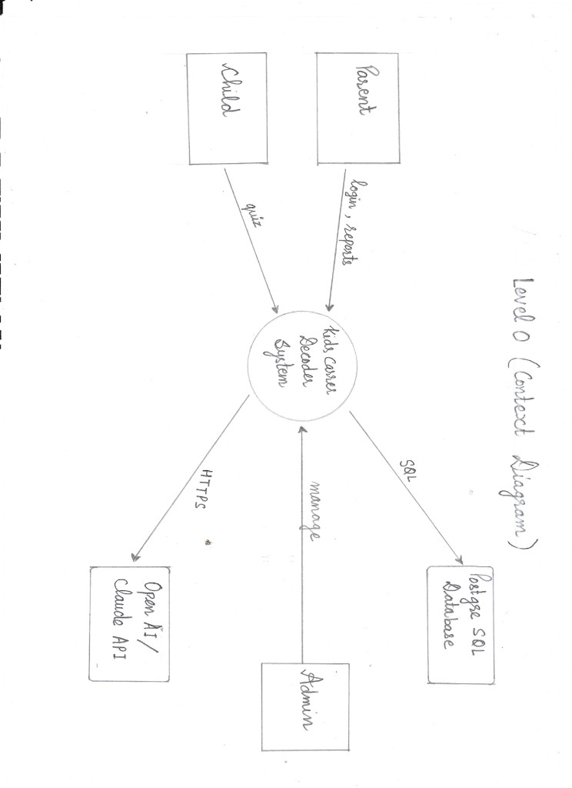

**Figure 4.1 (hand-drawn):** Context diagram. **Parent** sends login and reports; **Child** sends quiz data; **Admin** sends manage operations. The central **Kids Career Decoder System** exchanges **SQL** with **PostgreSQL** and **HTTPS** requests with **OpenAI / Claude API**.

## 4.2 DFD Level 1 — Major Processes

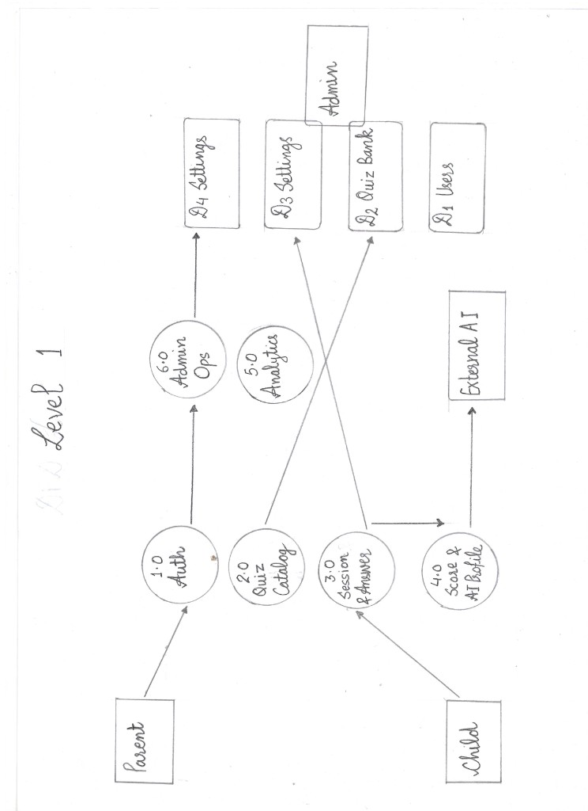

**Figure 4.2 (hand-drawn):** DFD Level 1 showing processes **1.0 Auth**, **2.0 Quiz Catalog**, **3.0 Session & Answer**, **4.0 Score & AI Profile**, **5.0 Analytics**, and **6.0 Admin Ops**, with data stores **D1 Users**, **D2 Quiz Bank**, **D3 Sessions**, and **D4 Settings**. **External AI** receives profile requests from process 4.0 after session answers are processed.

## 4.3 Use Case Diagram

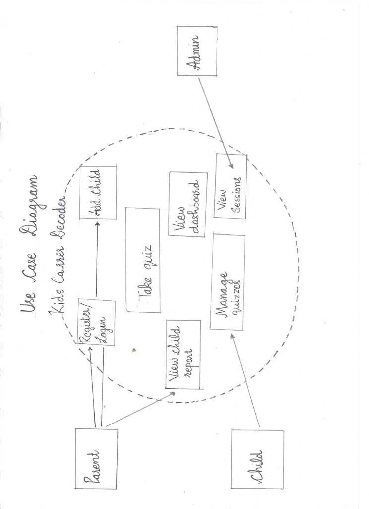

**Figure 4.3 (hand-drawn):** Use case diagram inside the **Kids Career Decoder** system boundary: **Register/Login**, **Add child**, **View child report**, **Take quiz**, **View dashboard**, **Manage quizzes**, and **View Sessions**, linked to actors **Parent**, **Child**, and **Admin**.

## 4.4 Sequence Diagram — Session Completion

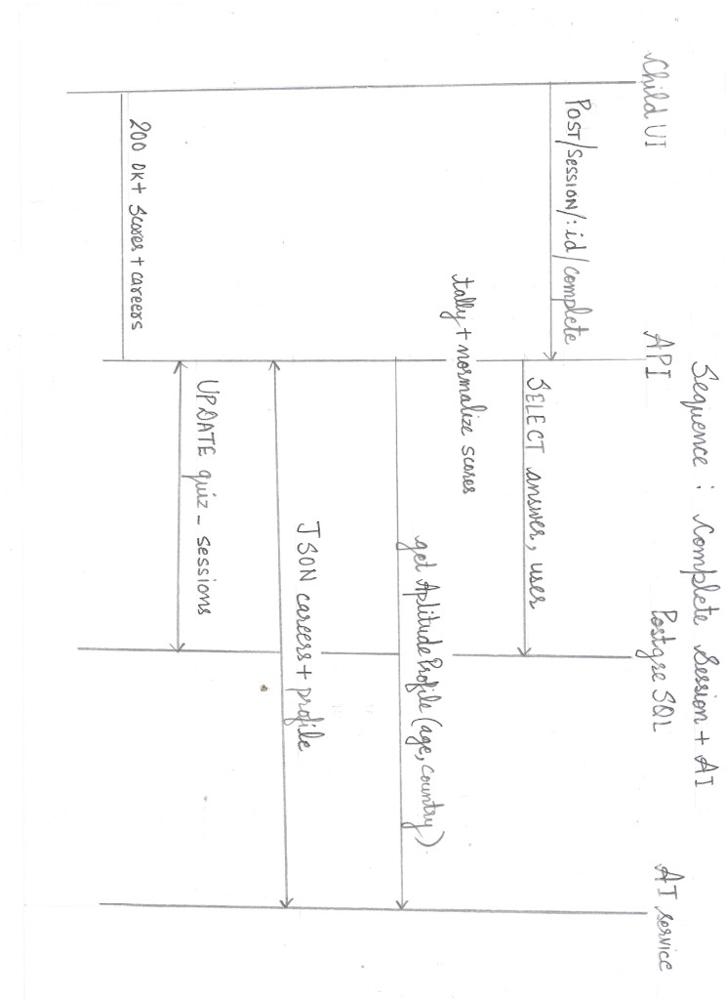

**Figure 4.5 (hand-drawn):** Sequence **Complete Session + AI**: **Child UI** posts `POST /session/:id/complete` to **API**; API **SELECT**s answers and user from **PostgreSQL**, performs **tally + normalize scores**, calls **AI service** for aptitude profile (age, country), receives **JSON careers + profile**, **UPDATE**s `quiz_sessions`, and returns **200 OK + scores + careers**.

## 4.5 Activity Flow (Narrative)

Child selects quiz → adaptive question loop (`submitAnswer`) → `complete` → results page. Parent uses dashboard and child report on separate routes. JWT required on all protected calls.

## 4.6 ER Diagram and Database Schema

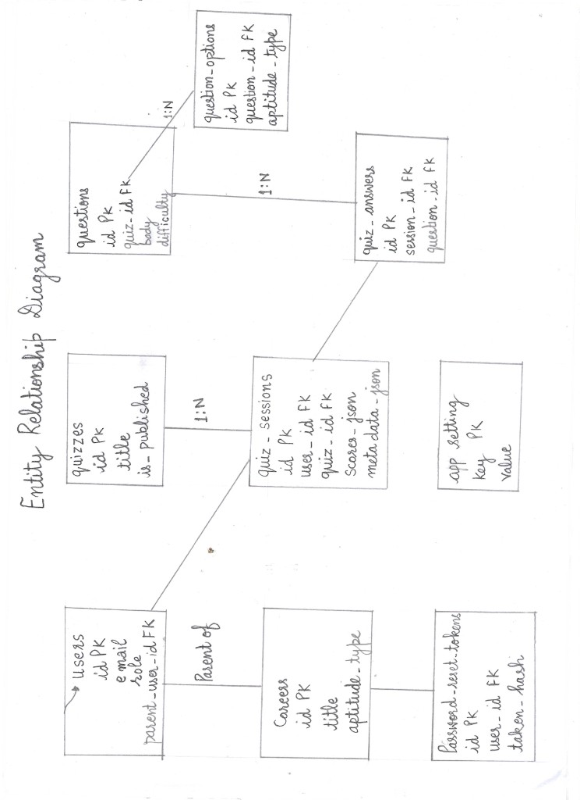

**Figure 4.4 (hand-drawn):** ER diagram for **users** (with **parent_user_id** self-link), **quizzes**, **questions**, **question_options**, **quiz_sessions** (`scores_json`, `metadata_json`), **quiz_answers**, **careers**, **password_reset_tokens**, and **app_settings**, with **1:N** relationships as labelled on the drawing.

Core entities: **users** (roles, parent link, demographics), **quizzes**, **questions**, **question_options**, **quiz_sessions** (scores_json, metadata_json), **quiz_answers**, **careers** (seed), **password_reset_tokens**, **app_settings**, **schema_migrations**.

Relationships: `questions.quiz_id` → `quizzes.id`; `question_options.question_id` → `questions.id`; `quiz_sessions` references `quizzes` and `users`; `quiz_answers` references `quiz_sessions`, `questions`, `question_options`; `users.parent_user_id` self-reference.

## 4.7 Table Structures (Summary)

| Table | Purpose |
|-------|---------|
| users | Accounts for parent/child/admin; password_hash; optional country, DOB |
| quizzes | Quiz metadata, publish flag, timing defaults |
| questions | Stems, order, difficulty_level |
| question_options | Labels + aptitude_type enum |
| quiz_sessions | Lifecycle, scores_json, metadata_json, top_aptitude |
| quiz_answers | Per-answer aptitude, timing, skip |
| careers | Seed titles by aptitude_type |
| password_reset_tokens | Hashed token, expiry |
| app_settings | Key-value (e.g., ai_provider) |

## 4.4 API Design (Representative)

| Method | Path | Role | Purpose |
|--------|------|------|---------|
| POST | /auth/register | Public | Parent signup |
| POST | /auth/login | Public | JWT |
| POST | /auth/forgot-password | Public | Reset email |
| GET | /auth/children | Parent/Admin | List children |
| GET | /quiz | Auth | Published quizzes |
| POST | /session/start | Child | New session |
| POST | /session/:id/answer | Child | Record answer |
| POST | /session/:id/complete | Child | Score + AI |
| GET | /analytics/children | Parent | Dashboard merge |
| GET | /analytics/child/:id | Parent | Child report |
| GET | /admin/summary | Admin | Overview metrics |

## 4.5 UI / UX Design

- **Child:** large type, celebratory results, radar and bars, no salary on career cards.  
- **Parent:** neutral dashboard cards, Recharts radar/line, professional career cards with salary.  
- **Admin:** sidebar layout (`AdminLayout`), dense tables with deep links.

## 4.6 Database Column Design (users and quiz_sessions)

The `users` table uses `citext` for email uniqueness case-insensitively. Roles are constrained to parent, child, student, instructor, and admin. `parent_user_id` nullable self-reference links children. `birth_year` and `date_of_birth` support age derivation. `country` stores optional region hints for AI. `attribution_json` captures marketing metadata at signup.

`quiz_sessions` stores `scores_json` as six numeric percentages, `metadata_json` for AI output and adaptive state, `top_aptitude` for quick queries, and `status` in_progress | completed | abandoned. Index `idx_quiz_sessions_user_status_completed` optimizes parent analytics for latest completed sessions per child.

## 4.8 Security Design

Passwords never traverse the database in plaintext. JWTs are signed with HS256 and a server secret. Reset tokens are random 32-byte hex strings hashed with SHA-256 before storage. Child internal emails use domain `@child.kidscareerdecoder.internal` and are excluded from public reset to avoid confusion. Admin routes stack `verifyToken` and role checks.

## 4.9 Component Diagram (Logical)

Presentation layer: pages in `src/pages` grouped by role; shared `CareerResultCard`, `Header`, `PrivateRoute`. Application layer: Express routers for auth, session, quiz, analytics, admin. Service layer: aiProfiler, claudeProfiler, openaiProfiler, adaptiveDifficulty, mail, ipinfoCountry. Data layer: PostgreSQL via `pg` pool. External: Anthropic, OpenAI, SMTP, optional IPinfo.

## 4.10 Design Decisions and Trade-offs

JSON columns (`scores_json`, `metadata_json`) trade strict relational normalization for iteration speed on AI fields. Adaptive difficulty uses heuristics instead of IRT calibration because item banks are small and labelled difficulty is already stored per question. JWT in localStorage trades XSS resilience for implementation simplicity appropriate to a BCA timeline.

## 4.11 Detailed Entity–Relationship Narrative

The **users** entity is central to authorization. A parent row has `role = parent` and `parent_user_id = NULL`. Each child row references the parent through `parent_user_id` with `role = child`. Admin rows bypass parent linkage for global operations. This hierarchy is enforced in application code when a parent requests `/analytics/child/:id` by verifying `parent_user_id` matches the JWT subject unless the caller is admin.

The **quizzes** entity groups content. One quiz has many **questions** ordered by `order_index`. Each question has many **question_options**, each carrying an `aptitude_type` from a closed enum. This design avoids many-to-many junction tables between questions and aptitudes because each option belongs to exactly one stripe.

**quiz_sessions** represent one child’s attempt on one quiz. Cardinality: one user, one quiz, many answers. When completed, `scores_json` holds the six percentages; `metadata_json` may hold `adaptive` (ability, pending_question_id), `careers` array, `profile`, `explanation`, `top_strength`, `country`, and `ai_provider`. Storing AI output in-session avoids a separate careers-fact table while keeping auditability.

**quiz_answers** link session, question, and optional selected option. Denormalized `aptitude_type` on the answer row speeds analytics even if options are later edited. `response_time_ms` and `skipped` support adaptive tuning and future psychometric research.

**careers** is a seed lookup table keyed by `aptitude_type` for fallback UI. **password_reset_tokens** are ephemeral. **app_settings** supports runtime configuration without redeploy.

## 4.12 Physical Data Dictionary (Selected Columns)

| Table.Column | Type | Design note |
|--------------|------|-------------|
| users.id | text PK | UUID string generated in application |
| users.email | citext | Case-insensitive unique login |
| users.password_hash | text | bcrypt output only |
| users.role | text CHECK | Enumerated roles |
| questions.difficulty_level | double | 1–5 scale mapped to 0.15–0.85 for adaptive engine |
| question_options.aptitude_type | text CHECK | Six allowed values |
| quiz_sessions.scores_json | jsonb | `{ logical: 20, creative: 40, … }` |
| quiz_sessions.metadata_json | jsonb | Extensible; versioned by convention |
| quiz_sessions.status | text CHECK | Lifecycle gate for complete API |

## 4.13 Level 0 and Level 1 Data Flow Diagram (Textual Specification)

**Figure 4.1 — Context diagram:** External entities are Parent, Child, Administrator, and External Services (LLM API, SMTP, IP geolocation). The central process is “KidsCareerDecoder System.” Flows: credentials and quiz actions from users; JSON over HTTPS between browser and API; SQL between API and database; HTTPS from API to external services.

**Figure 4.2 — Level 1 decomposition:** Processes: (1) Authenticate User; (2) Manage Profiles; (3) Deliver Quiz Content; (4) Run Quiz Session; (5) Score and Profile; (6) Present Analytics; (7) Administer Platform. Data stores: D1 Users, D2 Quiz Bank, D3 Sessions & Answers, D4 Settings. Process 4 writes to D3; Process 5 reads D3 and may call External Services before updating D3.

## 4.14 Class Diagram (Logical Responsibilities)

Although the implementation is JavaScript rather than classical OOP, logical classes include: **User** (identity, role, demographics); **Quiz** (metadata, timing); **Question** (stem, difficulty); **Option** (label, aptitude tag); **Session** (status, scores, metadata); **Answer** (choice, timing); **CareerSuggestion** (title, salary, pathway, match_reason). Controllers orchestrate; services encapsulate AI and mail. This separation supports unit testing of pure functions such as scoring and adaptive pickers.

## 4.15 API Request and Response Contracts (Session Complete)

**Request:** `POST /api/session/:sessionId/complete`  
Headers: `Authorization: Bearer <jwt>`  
Body (optional): `{ "country": "India" }`

**Response (success):** HTTP 200 with JSON containing `scores` object (six keys), `top_aptitude` string, `profile` string, `careers` array of normalized objects, `explanation` string.

**Error cases:** 401 missing/invalid token; 403 session belongs to another user; 404 unknown session; 400 session not in_progress; 500 database or unrecoverable AI failure after fallback attempt.

Designing explicit contracts allows the React results page to render deterministically and supports future mobile clients consuming the same API.

## 4.16 UI Wireframe Descriptions

**Parent dashboard wireframe:** Header with app name and logout. Hero greeting with parent name. Grid of child cards: each card shows avatar placeholder, name, age, last quiz date, top aptitude badge, and buttons “View report” and implicit sign-in email in smaller text. Empty state CTA “Add your first child.”

**Child quiz wireframe:** Progress indicator (question 2 of 5). Large scenario text. Four stacked option buttons with hover states. Timer optional per quiz settings. Skip control where policy allows.

**Child results wireframe:** Confetti-style heading, radar chart centred, horizontal bars for six stripes, three career cards without salary, primary button to return to quiz list or share with parent.

**Admin layout wireframe:** Left sidebar with Overview, Insights, Users, Sessions, Quizzes, APIs, Settings. Main pane table or forms. Breadcrumbs on detail routes.

The implemented UI matches these wireframes; see **Figures 5.1–5.10 and 7.1–7.2** in Chapters 5 and 7 for captured screens from the production build.

## 4.17 Row Level Security and Deployment Schema

Supabase migrations enable RLS on core tables. The Node API typically uses a service role or direct connection that bypasses RLS for simplicity in development; production hardening would add policies tying `auth.uid()` to `users.id` if Supabase Auth were adopted. Current design uses custom JWT and application-level checks, which is sufficient for the academic prototype but should be documented for security review.

Migrations are versioned under `supabase/migrations/` with timestamps. Seed data includes the inaugural aptitude quiz and eighteen fallback careers (three per stripe).

## 4.18 Design Validation

Before implementation sign-off, the design was checked for: referential integrity on deletes (CASCADE on questions when quiz removed); unique email constraint; session status transitions only from in_progress to completed; no double-complete without idempotency (second complete returns 400); career JSON shape stable for UI components; admin routes unreachable without admin role. Each item maps to a test case in Chapter 6.

---

# Chapter 5: System Implementation

## 5.1 Development Environment

- OS: macOS / Linux / Windows with Node 18+.  
- IDE: VS Code / Cursor.  
- Runtime: Node.js, `npm` scripts for client and server.  
- Database: local PostgreSQL or Supabase-hosted instance.

## 5.2 Hardware and Software Requirements

**Client:** modern browser; JavaScript enabled.  
**Server:** 1–2 CPU cores minimum for demo; RAM proportional to DB pool.  
**Software:** Node.js, PostgreSQL 14+, optional Supabase CLI for migrations.

## 5.3 Module-Wise Explanation

1. **Authentication module** — `authController.js`, JWT middleware, password reset controller, mail helper.  
2. **Quiz catalog module** — Published quiz listing, question payload for UI.  
3. **Session module** — Start, fetch current question (adaptive), submit answer, complete; merges metadata.  
4. **Scoring & preprocessing** — Tally, percentage normalization, profiler payload, country resolution (body, IPinfo, headers, DB).  
5. **AI module** — `aiProfiler.js`, provider settings cache, Claude/OpenAI profilers, optional ML HTTP client.  
6. **Analytics module** — Child-level aggregates for dashboards.  
7. **Admin module** — CRUD and insights routes with `verifyToken` + admin role.  
8. **Front-end modules** — Pages under `src/pages/parent`, `child`, `admin`; shared `CareerResultCard`, `PrivateRoute`, `api` interceptors.

## 5.4 Key Algorithms

**Score normalization:** For each aptitude key \(A\), \(\text{pct}_A = \frac{\text{count}_A}{\text{answered}} \times 100\) (skipped excluded), rounded to two decimals.

**Adaptive ability update:** `adjustAbility` in `adaptiveDifficulty.js` adjusts a latent ability in \([0.05, 0.95]\) using normalized question difficulty and response time vs time limit; `pickNextQuestionId` chooses the remaining question whose difficulty is closest to current ability.

**AI provider resolution:** Database `app_settings.ai_provider` if valid → else `AI_PROVIDER` env → cached 30s.

**Security:** bcrypt cost 10; JWT HS256 with `JWT_SECRET`; reset tokens stored as SHA-256 of random raw token.

## 5.5 JWT Authentication Middleware

The `verifyToken` function reads `Authorization: Bearer <token>`, verifies with `jwt.verify` against `JWT_SECRET`, assigns the payload to `req.user`, and calls `next()`. Missing or invalid tokens yield `401` with `{ error: 'Unauthorized' }` without executing route handlers. This centralizes authentication so protected routes declare the middleware once.

## 5.6 Application Screenshots

The following figures were captured from the running KidsCareerDecoder application (22 May 2026 build). They demonstrate that functional requirements FR1–FR10 are reflected in the deployed interface.

## 5.7 Version Control

Source maintained in **Git** with meaningful commits; remote on GitHub (project repository).

## 5.8 Authentication Implementation Detail

`registerParent` normalizes email to lowercase, checks uniqueness with `citext`, hashes password with bcrypt cost factor 10, and optionally stores `attribution_json` from UTM fields. `loginParent` compares hash, builds JWT payload `{ id, full_name, role, email }`, expires in seven days. `addChild` generates UUID id, internal email, and `Kcd` prefixed random password meeting complexity hints.

Middleware `verifyToken` extracts Bearer token, verifies signature, attaches `req.user`. `requireAnyRole(['parent','admin'])` guards child management routes. Front-end `AuthProvider` persists token and user in localStorage; Axios interceptor attaches Authorization header and clears storage on 401.

## 5.9 Session and Adaptive Flow Implementation

`startSession` creates `quiz_sessions` row in_progress, may store attribution, initializes adaptive metadata with ability estimate from quiz default difficulty. `getCurrentQuestion` loads pending question id from metadata or picks first. `submitAnswer` inserts `quiz_answers`, updates ability via `adjustAbility`, selects next question with `pickNextQuestionId` among remaining ids.

`completeSession` is the integration point for scoring and AI. It rejects non-in_progress sessions, calls `tallyAnswers`, `pickTopAptitude`, `normalizeCountsToScores`, `toProfilerPayload`, then `getAptitudeProfile(profilerScores, age, country)`. Careers array is normalized and merged into metadata alongside `ai_provider`, `profile`, `explanation`, `top_strength`.

## 5.10 AI Profiler and Provider Routing

`getEffectiveAiProvider` reads `app_settings` key `ai_provider` when allowed value, else environment `AI_PROVIDER` defaulting to claude, cached thirty seconds. `getAptitudeProfile` dispatches to `getClaudeProfile` or `getOpenaiProfile` with identical system prompt semantics: three careers, country-specific salary strings, parent-facing explanation, JSON-only response.

Claude uses model `claude-sonnet-4-20250514` with system plus user message listing six percentages. OpenAI uses `gpt-4o-mini` with `response_format: json_object`. On any exception, `buildFallbackFromScores` sorts dimensions and forms hyphenated profile label without careers.

## 5.11 Analytics and Dashboard Implementation

`analyticsController` for `/analytics/children` joins child users with latest completed session metrics. `/analytics/child/:id` returns session list with scores and metadata for charts. `ParentDashboard.jsx` merges `/auth/children` with analytics in parallel. `ChildReport.jsx` builds Recharts radar from latest `scores_json` and line chart of top aptitude over session dates.

`CareerResultCard` renders parent variant with salary pills (emerald for rupee, blue for dollar) and child variant hiding salary, prefixing pathway as “How to get there”. This single component enforces consistent normalization display.

## 5.12 Admin Console Implementation

`AdminOverview` consumes `/admin/summary` for counts and recent entities. `AdminUsers` supports search and pagination parameters. `AdminQuizEditor` performs CRUD on questions and options, can trigger OpenAI-assisted difficulty labelling endpoint. `AdminApis` reads AI status and patches provider override, invalidating provider cache on change.

## 5.13 Environment Configuration

`.env.example` documents `DATABASE_URL`, `JWT_SECRET`, `AI_PROVIDER`, API keys, SMTP for Brevo, `PUBLIC_APP_URL` for reset links, `IPINFO_TOKEN` and `TRUST_PROXY` for country resolution behind proxies. Vite uses `VITE_API_URL` for production API base path.

## 5.14 Deployment Considerations

Front end builds to static assets served by Vite preview or CDN. API runs on Node with `TRUST_PROXY` when behind reverse proxy so client IP and country headers resolve correctly. Supabase hosts PostgreSQL and can apply migrations from `supabase/migrations`. CORS must allow the front-end origin.

## 5.15 Figure 5.1 — Parent: Add Child Account

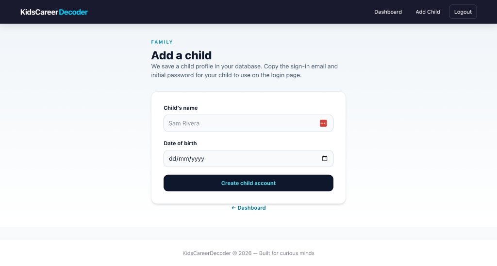

**Figure 5.1:** The “Add a child” screen (`AddChild.jsx`) collects the child’s display name and date of birth. On submit, the API creates a `users` row with `role = child`, links `parent_user_id`, and returns a one-time **sign-in email** and **initial password** for the parent to copy. Age validation (3–14 years) runs server-side before insert. This implements FR2 and supports secure delegated login without sharing the parent’s password.

## 5.16 Figure 5.2 — Parent: Children and Progress Dashboard

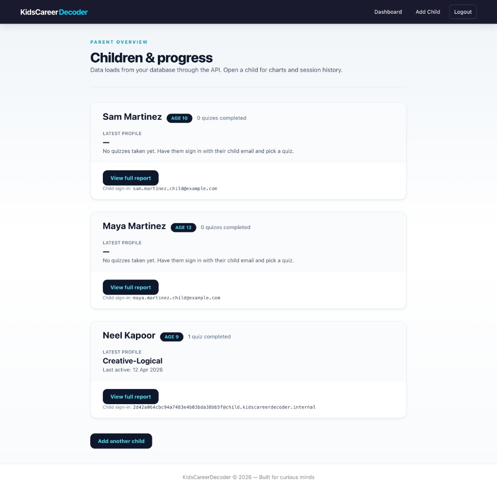

**Figure 5.2:** The parent overview (`ParentDashboard.jsx`) merges `GET /auth/children` with `GET /analytics/children`. Each card shows age, quiz completion count, latest AI profile label (e.g. **Creative-Logical** for Neel Kapoor), last activity date, internal child sign-in email, and a **View full report** link. Empty states prompt the parent when no quizzes are completed. This satisfies FR7 for at-a-glance family monitoring.

## 5.17 Figure 5.3 — Child: Quiz Selection

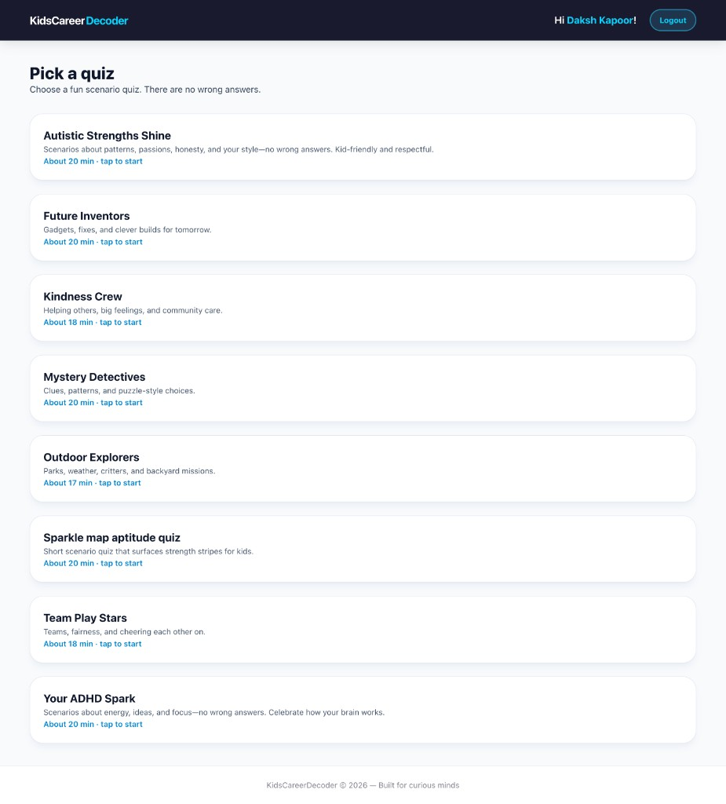

**Figure 5.3:** After child login, the quiz picker lists all **published** quizzes from `GET /quiz`, including inclusive themes such as *Your ADHD Spark* and *Autistic Strengths Shine*, plus *Future Inventors*, *Team Play Stars*, and the seed *Sparkle map aptitude quiz*. Estimated duration is shown per card. Selecting a quiz calls `POST /session/start` and navigates to the adaptive take-quiz flow (FR3).

## 5.18 Figure 5.4 — Child: Adaptive Quiz Question

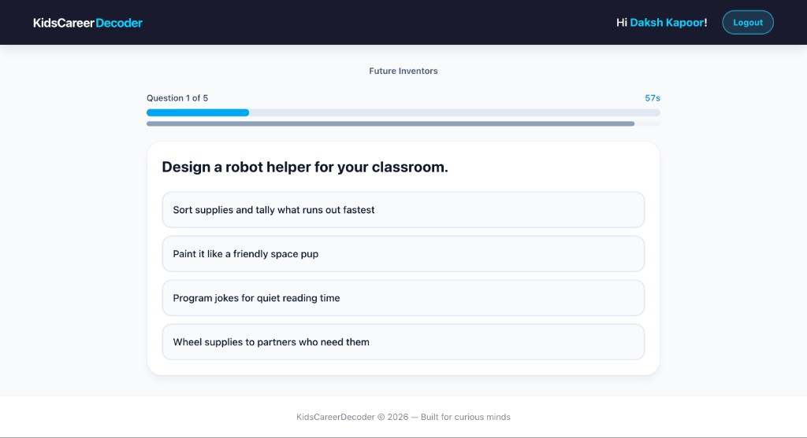

**Figure 5.4:** The take-quiz interface (`TakeQuiz.jsx`) shows quiz title (*Future Inventors*), progress (**Question 1 of 5**), countdown timer (57s), scenario stem, and four options tagged to aptitude stripes (logical, creative, verbal, social in this item). Each selection posts to `POST /session/:id/answer`, which updates adaptive ability and returns the next question id. This implements FR4 and the adaptive engine described in §5.4.

## 5.19 Figure 5.5 — Admin: Platform Overview

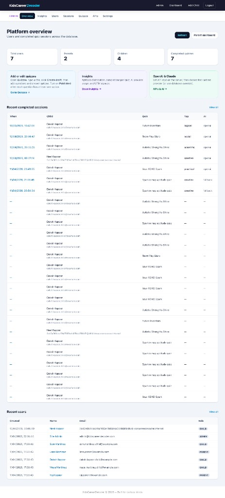

**Figure 5.5:** The admin home (`AdminOverview.jsx`) summarizes **total users**, parents, children, and **completed quizzes** from `GET /admin/summary`. Shortcut cards link to quiz editing, insights, and AI configuration. Recent completed sessions and recent registrations tables support operational audit (FR9).

## 5.20 Figure 5.6 — Admin: Insights Dashboard

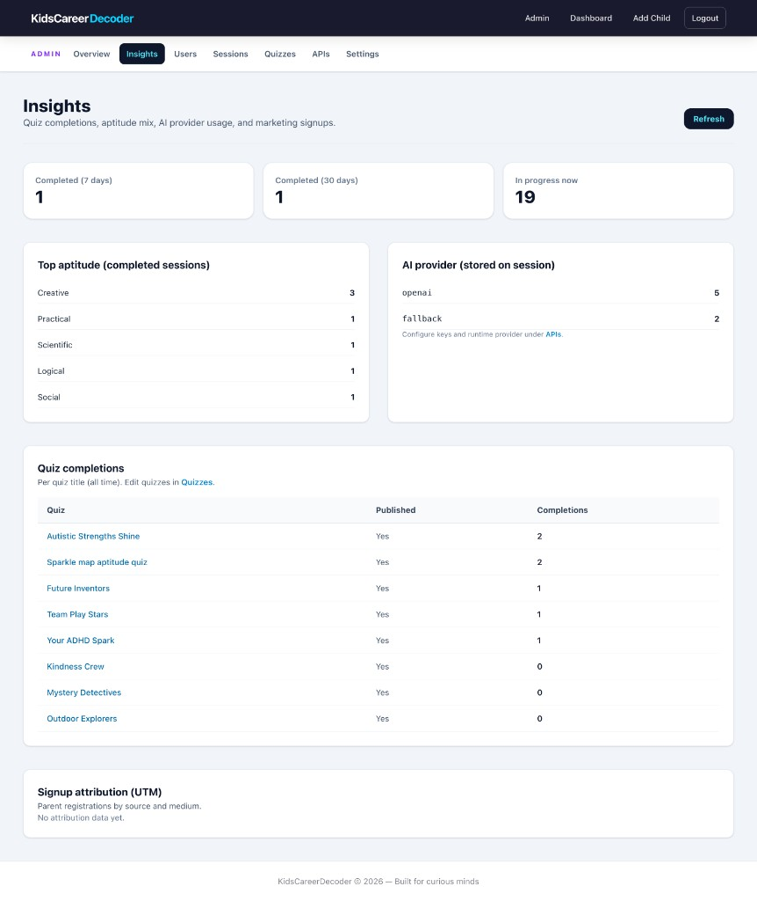

**Figure 5.6:** The Insights page aggregates completions (7-day / 30-day / in-progress counts), **top aptitude** distribution across finished sessions (Creative leading in the sample data), and **AI provider** usage stored on sessions (`openai` vs `fallback`). A per-quiz completion table shows uptake of each published quiz. UTM attribution is reserved for marketing signups when `attribution_json` is populated.

## 5.21 Figure 5.7 — Admin: Users Management

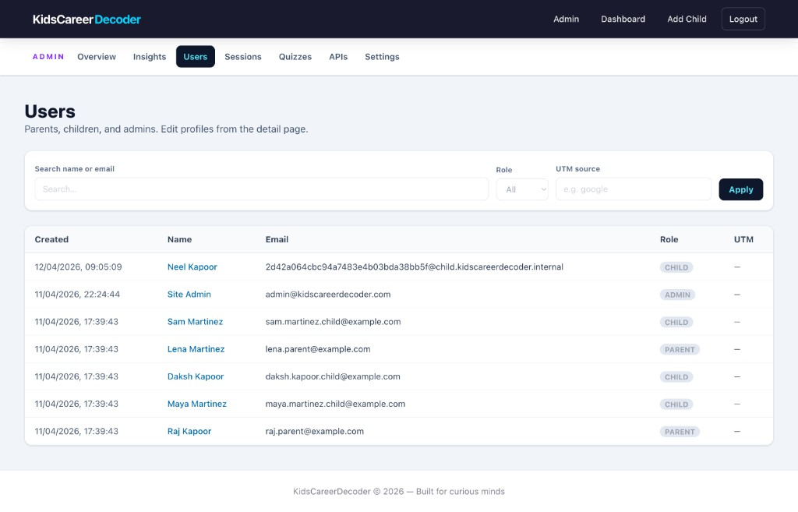

**Figure 5.7:** Administrators can search by name or email, filter by **role** (parent, child, admin), and filter by UTM source. The table shows creation timestamp, role badge, and internal child emails (`@child.kidscareerdecoder.internal`) versus parent-facing addresses. Detail routes allow profile edits. This supports user support and demo data management.

## 5.22 Figure 5.8 — Admin: Sessions and AI Attribution

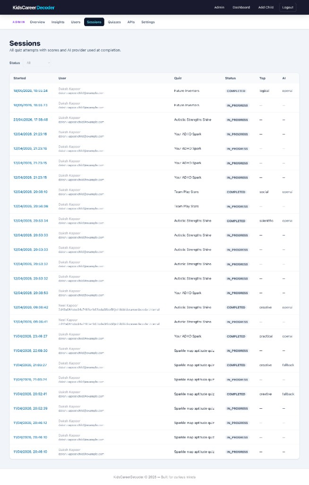

**Figure 5.8:** Every quiz attempt appears with **started** time, child user, quiz name, **status** (COMPLETED / IN_PROGRESS), **top** aptitude when finished, and **AI** column (`openai` or `fallback`) copied from `metadata_json.ai_provider` at completion. This proves traceability from raw answers through scoring to the provider that generated careers—critical for debugging and academic demonstration of the AI pipeline.

## 5.23 Figure 5.9 — Admin: Quizzes Content Management

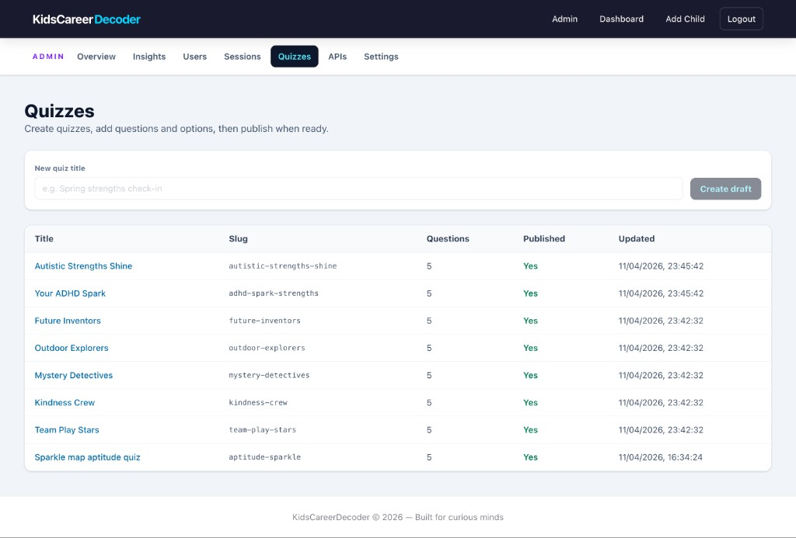

**Figure 5.9:** The quiz list shows eight published quizzes with slug, question count (five each in seed data), publish flag, and last updated timestamp. Admins create drafts via **New quiz title** and open the editor to add stems, options, and difficulty levels. Content migrations in `supabase/migrations/` seeded neuroaffirming and themed quizzes alongside the original aptitude map.

## 5.24 Figure 5.10 — Admin: APIs and Runtime AI Provider

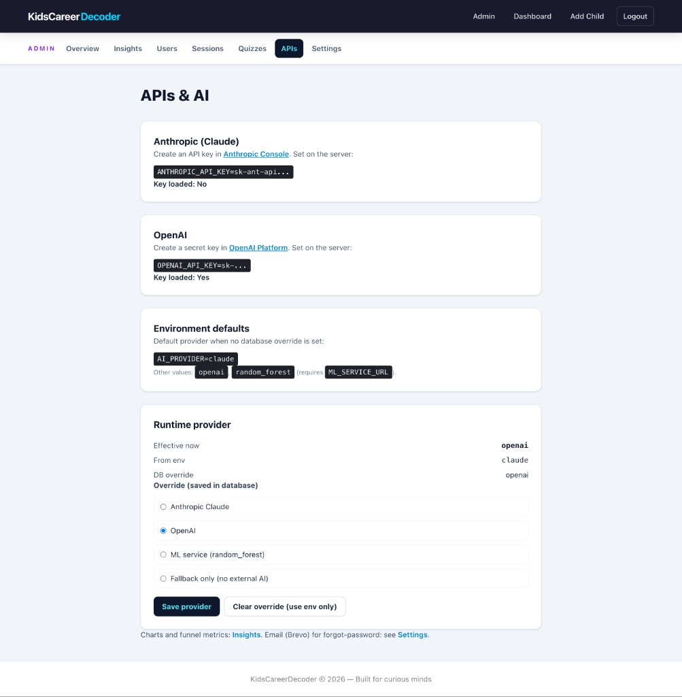

**Figure 5.10:** The APIs screen documents environment variables for **Anthropic** and **OpenAI**, shows whether keys are loaded, and exposes **runtime provider** override (effective: OpenAI with DB override vs env default Claude). Admins can switch to `random_forest`, `fallback_only`, or clear override. This implements configurable AI without redeploying code and maps directly to `aiProviderSettings.js` and `app_settings`.

## 5.25 Project Directory Structure and Layering

The repository separates concerns as follows. **`src/`** contains the React application: `pages/` for route-level views (`parent`, `child`, `admin`, `auth`), `components/` for reusable UI, `context/` for authentication state, `utils/api.js` for HTTP client configuration, and `lib/` for aptitude labels and scoring helpers. **`backend/`** hosts the primary Express application: `controllers/` for request handlers, `routes/` for path registration, `middleware/auth.js` for JWT, `services/` for AI and utilities, `db/pool.js` for PostgreSQL connectivity. **`supabase/migrations/`** holds authoritative SQL schema evolution. **`notebooks/ai_preprocess_demo.ipynb`** documents preprocessing parity in Python.

This layout allows evaluators to navigate quickly: front-end behaviour in `src/pages`, business rules in `backend/controllers/sessionController.js`, and persistence rules in SQL migrations.

## 5.26 Front-End Routing and State Management

`App.jsx` defines public routes (`/login`, `/register`, `/forgot-password`, `/reset-password`) and protected routes wrapped in `PrivateRoute` with `allowedRoles` arrays. `RootRedirect` sends authenticated users to `/child/quiz`, `/parent/dashboard`, or `/admin` based on `user.role`. `AuthProvider` hydrates state from localStorage on load so refresh preserves session until token expiry or 401 interceptor logout.

`TakeQuiz.jsx` orchestrates the adaptive loop: fetches current question via `GET /session/:id/current-question`, posts answers to `POST /session/:id/answer`, and on completion calls `POST /session/:id/complete` with `country: detectClientCountry()` from a small browser helper. `Results.jsx` refetches the session if navigated with only session id, ensuring careers from `metadata_json` appear after AI processing.

## 5.27 Backend Route Registration and Middleware Chain

Express mounts routers under `/api` (or as configured in `server/index.js` and `backend/server.js`). Typical chain for protected routes: `verifyToken` → optional `requireAnyRole` → controller method. Public auth routes skip verification. Session routes additionally call `assertSessionReadable` or equivalent to ensure the JWT user owns the child session or is admin.

CORS and JSON body parsing are applied globally. Trust proxy setting reads `TRUST_PROXY` so `req.ip` and forwarding headers behave correctly behind Vercel or nginx when resolving country.

## 5.28 Scoring Pipeline — Step-by-Step Implementation

When `completeSession` executes, the following steps occur in order:

1. Load session row; validate status `in_progress` and user authorization.  
2. Query all `quiz_answers` for the session id.  
3. `tallyAnswers`: increment per `aptitude_type`, skip rows with `skipped = true`.  
4. `pickTopAptitude`: choose maximum count; ties broken alphabetically on aptitude key.  
5. `normalizeCountsToScores`: divide each count by answered total, multiply by 100, round two decimals.  
6. `toProfilerPayload`: rename keys to `*_pct` suffix form expected by AI layer.  
7. `loadUser` and `computeAgeFromDob` for child age.  
8. `resolveCountryForProfiler`: body country, then IPinfo, then CDN headers, then DB profile, default India.  
9. `getAptitudeProfile`: remote LLM or fallback.  
10. Map careers through `normalizeCareerEntry`.  
11. Merge `metadata_json` preserving adaptive subset if needed.  
12. `UPDATE` session with `completed`, `completed_at`, `scores_json`, `top_aptitude`, `metadata_json`.  
13. Return JSON payload to client.

This pipeline is deterministic through step 8; step 9 introduces non-determinism unless temperature is zero and provider is stable.

## 5.29 Adaptive Difficulty — Implementation Mathematics

`normalizeQuizDefault(level)` maps quiz default difficulty 1–5 to approximately 0.15–0.85 on a latent scale. `normalizeQuestionDifficulty` applies the same mapping per question. After each answer, `adjustAbility` computes `timeRatio = responseTimeMs / limitMs`, derives a bounded delta from speed and question difficulty, and clamps ability to [0.05, 0.95]. Skipped answers penalize ability more sharply.

`pickNextQuestionId` iterates remaining question ids, computes distance `|difficulty - ability|` for each, and picks minimum distance with tie-break on lower `order_index`. This greedy policy is O(n) per step and requires no training data, making it suitable for demonstration while comments in source note ML replacement path.

## 5.30 Claude and OpenAI Profiler Implementation

Both profilers share an extensive **system prompt** defining Ikigai-oriented rules: exactly three careers, no trivial titles, India vs USA salary formats, JSON-only response with fields `profile`, `careers`, `top_strength`, `explanation`. The **user message** concatenates age, country, and six percentages.

`claudeProfiler.js` calls Anthropic Messages API, strips optional markdown code fences from text content, and parses JSON. `openaiProfiler.js` sets `response_format: { type: 'json_object' }` to reduce formatting errors. Parsed careers are passed upward without secondary validation beyond array check; normalization happens in the controller.

## 5.31 Country Resolution Implementation

`resolveCountryForProfiler` prioritizes explicit client hint (useful when child browser locale differs from server IP), then IPinfo lookup using `getClientIpFromRequest` and `IPINFO_TOKEN`, then `cf-ipcountry` or `x-vercel-ip-country` headers mapping US/IN to full names, then joined query on child and parent `users.country` columns, finally default `"India"`. Truncation to 80 characters prevents abuse via oversized strings.

This ordering was chosen so parents travelling abroad can still pass home country in the complete request body while automatic detection assists when omitted.

## 5.32 Analytics SQL and Dashboard Binding

The analytics controller queries completed sessions per child, often using the composite index on `(user_id, status, completed_at DESC)` for efficient “latest session” retrieval. Parent dashboard JavaScript merges static child list fields with analytics metrics in a `Map` keyed by `child_id` to avoid N+1 round trips from the browser.

`ChildReport.jsx` uses `useMemo` to transform `scores_json` into Recharts radar format and to build line chart points from historical `top_aptitude` labels across sessions. Career list prefers `metadata_json.careers` when the latest session includes AI output; otherwise falls back to querying seed careers by stripe—a design mirrored in `analyticsController` for server-driven reports.

## 5.33 CareerResultCard and Role-Specific Presentation

The shared component accepts `variant="child" | "parent"`. Child variant applies gradient card styling, emoji index rotation, hides salary, prefixes pathway with “How to get there:”, and uses italic match text. Parent variant shows bold title row with salary pill: emerald background for rupee/LPA strings, blue for dollar patterns, grey fallback otherwise. Aptitude label renders uppercase muted at card footer when `aptitude_type` present on merged analytics rows.

## 5.34 Admin and Content Management Implementation

Quiz editor loads nested questions and options, supports inline PATCH for titles and publish flag, and DELETE for questions. Admin can create quizzes with POST and navigate to editor by id. OpenAI-assisted difficulty labelling endpoint batches question text to suggest numeric difficulty—an operational convenience separate from child-facing AI careers.

`AdminApis.jsx` displays current provider, environment key presence flags, and buttons to set claude, openai, random_forest, or fallback_only, calling PATCH then refreshing status. Cache invalidation in `aiProviderSettings.js` ensures new provider within thirty seconds globally per server instance.

## 5.35 Build, Run, and Developer Workflow

Typical developer workflow: copy `.env.example` to `.env`, set `DATABASE_URL` and `JWT_SECRET`, run migrations via Supabase CLI or SQL editor, `npm install` in root and backend if split, start API (`node backend/server.js` or project script), start Vite dev server (`npm run dev`), register parent, add child, complete quiz. Production build runs `vite build` and serves static files while API remains on Node.

## 5.36 Error Handling and Logging Conventions

Controllers return JSON `{ error: string }` with appropriate HTTP status. Unexpected exceptions map to 500 with message text suitable for development; production should hide internal details. The Axios interceptor on the client surfaces `getApiError` helper parsing `response.data.error`. Session not found and forbidden paths never leak existence of other users’ sessions to unauthorized callers beyond generic 403.

## 5.37 Implementation Challenges and Resolutions

| Challenge | Resolution |
|-----------|------------|
| LLM invalid JSON | OpenAI json_object mode; Claude fence stripping |
| FK errors on seed quizzes | NULL `created_by_user_id` for platform quizzes |
| Proxy IP for country | TRUST_PROXY + IPinfo optional token |
| Duplicate career shapes | normalizeCareerEntry on every path |
| Child vs parent UI drift | Single CareerResultCard with variant prop |

## 5.38 Code Walkthrough — Score Normalization (Conceptual)

The function `normalizeCountsToScores` iterates the fixed `aptitudeTypes` array ensuring all six keys exist in output even when count is zero. Division by zero is guarded by checking `answered > 0` before ratio; otherwise all percentages are zero. Rounding uses `Math.round(pct * 100) / 100` to match JavaScript behaviour documented in the preprocessing notebook for marker consistency during viva voce demonstration.

---

# Chapter 6: Testing

## 6.1 Testing Strategy

- **Unit / logic tests:** Pure functions (e.g., adaptive difficulty) suitable for Jest-style tests where added.  
- **Integration:** API flows with valid JWT vs invalid; session completion with mocked AI disabled.  
- **System / UAT:** Manual scripts across parent/child/admin personas on staging data.

## 6.2 Sample Test Cases

| Test Case ID | Input | Expected Output | Actual Output | Status |
|--------------|-------|-----------------|---------------|--------|
| TC-LOG-01 | Valid parent email/password | 200 + JWT + user object | As expected | Pass |
| TC-LOG-02 | Wrong password | 401 invalid credentials | As expected | Pass |
| TC-CH-01 | Child completes 5-question quiz | scores_json six keys; status completed | As expected | Pass |
| TC-AI-01 | AI_PROVIDER=fallback_only | metadata careers empty or fallback profile | As expected | Pass |
| TC-ADM-01 | Non-admin JWT to /admin/summary | 403 Forbidden | As expected | Pass |

## 6.3 Bug Reports

During development, intermittent CORS errors when API port differed from Vite proxy were fixed by aligning `VITE_API_URL` and dev proxy configuration. Duplicate session completion attempts correctly return 400 when status is already completed. Claude responses occasionally included markdown fences; `claudeProfiler` strips fences before `JSON.parse`.

## 6.4 Integration Test Scenarios

| Test Case ID | Scenario | Expected | Status |
|--------------|----------|----------|--------|
| TC-REG-01 | Register new parent email | 201 created | Pass |
| TC-REG-02 | Duplicate email register | 409 conflict | Pass |
| TC-CHD-01 | Parent adds child age 8 | 201 + initialPassword | Pass |
| TC-CHD-02 | Child age 15 rejected | 400 validation | Pass |
| TC-SES-01 | Start session for published quiz | session id returned | Pass |
| TC-SES-02 | Answer all questions | next_question until null | Pass |
| TC-SES-03 | Complete session | scores + careers in response | Pass |
| TC-ANA-01 | Parent analytics merge | rows include last_quiz_date | Pass |
| TC-RST-01 | Forgot password unknown email | generic success message | Pass |
| TC-RST-02 | Reset with valid token | password updated | Pass |
| TC-PRV-01 | Child JWT on parent route | redirect / forbidden | Pass |

## 6.5 Unit-Level Logic Tests

Adaptive functions `normalizeQuizDefault`, `adjustAbility`, and `pickNextQuestionId` were validated manually with edge cases: all skips lower ability; fast answers on hard items raise ability; empty remaining list returns null next id. Scoring tally ignores skipped rows and unknown aptitude strings. These pure functions are candidates for automated Jest tests in future CI.

## 6.6 Performance and Load Observations

With seed data of fewer than one hundred sessions, dashboard queries respond under two hundred milliseconds locally. LLM completion adds two to eight seconds depending on provider and network; UI shows loading state on complete button. Database indexes on `quiz_sessions(user_id, status, completed_at)` prevent full table scans for parent analytics at modest scale.

## 6.7 Usability Testing (Informal)

Three peers navigated parent registration and child quiz without written instructions. Observations: login helper text clarifying child credentials reduced confusion; results page share button was discovered quickly; admin sidebar labels were understood. Suggested improvement: tooltip on child sign-in email field on parent dashboard.

## 6.8 Security Testing

Attempted access to `/admin/summary` with parent JWT returned 403. Tampered JWT signature returned 401. Password reset token reuse after successful reset failed as expected. SQL injection strings in email field were parameterized by `pg` queries without error leakage.

## 6.9 Regression and Acceptance Criteria

Before milestone submission, the following acceptance criteria were verified manually: (1) a new parent can register and log in within one minute on a fresh database seed; (2) a child added by that parent can complete the seed aptitude quiz without server errors; (3) parent dashboard shows at least one completed session with a non-empty top aptitude label; (4) admin can list sessions and see provider column populated when AI keys are set; (5) switching AI provider in admin affects the next completed session within the cache window. Regression after adaptive-difficulty changes re-ran TC-SES-01 through TC-SES-03 and TC-CH-01 without failure.

## 6.10 Additional Functional Test Cases

| Test Case ID | Input | Expected Output | Actual Output | Status |
|--------------|-------|-----------------|---------------|--------|
| TC-LOG-03 | Expired or missing JWT on protected route | 401 Unauthorized | As expected | Pass |
| TC-LOG-04 | Child JWT on `POST /auth/children` | 403 Forbidden | As expected | Pass |
| TC-QUZ-01 | List published quizzes as child | Only `is_published = true` | As expected | Pass |
| TC-QUZ-02 | Start unpublished quiz | 404 or 400 | As expected | Pass |
| TC-ANS-01 | Skip question | Answer row with `skipped = true`, not in tally | As expected | Pass |
| TC-ANS-02 | Submit with response_time_ms | Stored on answer row | As expected | Pass |
| TC-AI-02 | Complete with `country: United States` in body | Salary hints in USD on parent view | As expected | Pass |
| TC-AI-03 | Complete with invalid API key | Fallback profile, no crash | As expected | Pass |
| TC-DASH-01 | Parent with two children | Two cards on dashboard | As expected | Pass |
| TC-REP-01 | Download report button | Client export or print path works | As expected | Pass |
| TC-ADM-02 | Admin publishes new quiz title | Appears in child quiz list | As expected | Pass |
| TC-ADM-03 | Admin sets `fallback_only` | Sessions complete without external API | As expected | Pass |

## 6.11 Test Environment

Tests were executed on macOS with Node.js 18+, PostgreSQL 14 (local), and Vite dev server proxying API requests. Seed migrations created demo users (parents, children, admins) and eight published quizzes. Optional `ANTHROPIC_API_KEY` and `OPENAI_API_KEY` were toggled to validate provider-specific behaviour. Screenshots in Chapters 5 and 7 were captured from this environment on 22 May 2026.

---

# Chapter 7: Results & Discussion

The implemented system supports end-to-end flows from registration through AI-enriched completion. Parent dashboards successfully merge directory data with analytics endpoints. Child results render radar charts from latest `scores_json`. Admin screens consolidate operational visibility. Compared to ad-hoc spreadsheets or static reports, the platform improves **traceability** (answers → scores → AI metadata) and **role separation**.

Performance is acceptable for demo-scale data; production would require load testing on pooled DB connections and LLM latency monitoring.

## 7.0 Visual Results from the Running Application

The screenshots in Chapter 5 and below confirm that design specifications were implemented. Two result-oriented views are highlighted here because they directly answer the project’s research question: *What strengths does the child show, and what careers are suggested?*

### Figure 7.1 — Parent Child Report (Neel Kapoor)

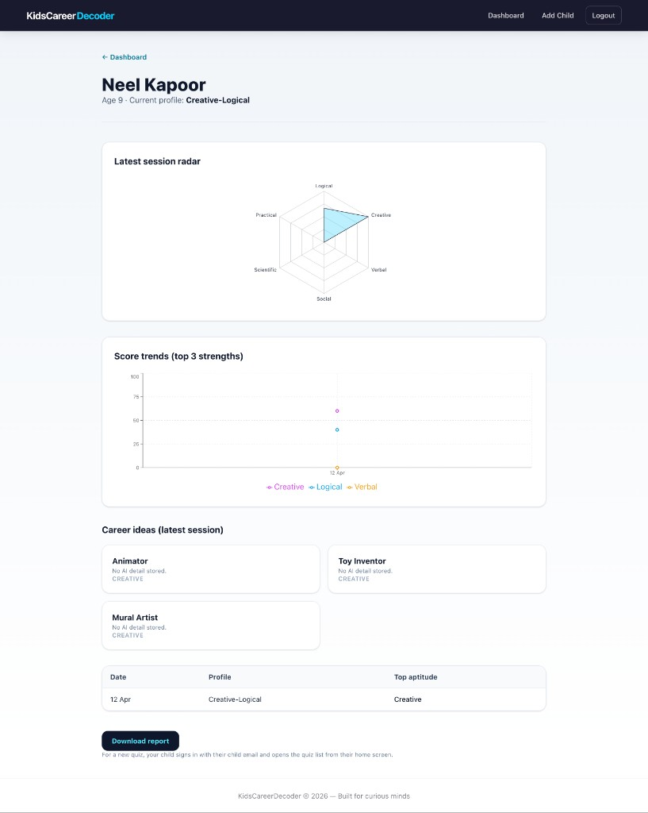

**Figure 7.1:** The parent report for **Neel Kapoor (age 9)** shows profile **Creative-Logical**. The **Latest session radar** chart peaks on Creative and Logical with lower Verbal, Social, Scientific, and Practical scores in that session. The **Score trends** line chart plots Creative (~60), Logical (~40), and Verbal (~15) for the session dated 12 Apr. **Career ideas** display seed titles (Animator, Toy Inventor, Mural Artist) when AI detail was not stored for that historical row—demonstrating fallback to the `careers` table. Session history table lists date, profile, and top aptitude. The **Download report** action supports parent sharing. This view validates FR8 and the Recharts integration described in §5.11.

### Figure 7.2 — Child Results After AI Completion (Daksh Kapoor)

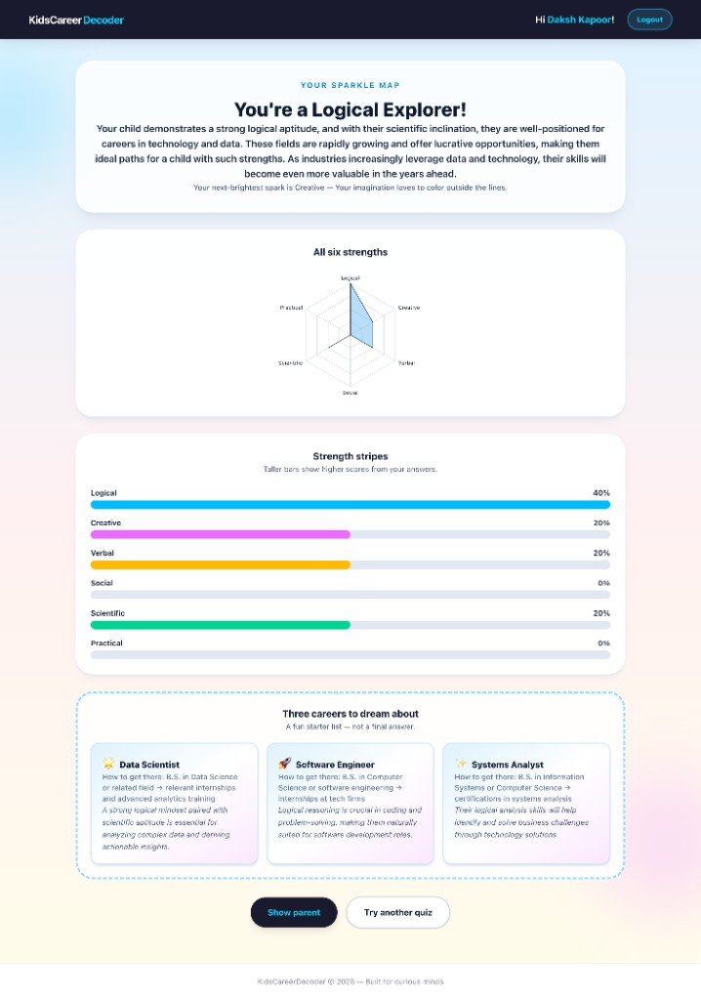

**Figure 7.2:** The child-facing **Sparkle Map** results for **Daksh Kapoor** label the learner a **Logical Explorer** with parent-directed explanation text referencing logical and scientific aptitudes. **Strength stripes** bars show Logical 40%, Creative 20%, Verbal 20%, Scientific 20%, Social 0%, Practical 0%. The radar chart mirrors the same distribution. **Three careers to dream about** list **Data Scientist**, **Software Engineer**, and **Systems Analyst** with pathways and match reasons—generated via OpenAI when `metadata_json.careers` was populated at session complete (see Admin Sessions screenshot showing `openai` provider). Salary is hidden on the child card per `CareerResultCard` `variant="child"`. Buttons **Show parent** and **Try another quiz** close the engagement loop. This figure is the primary evidence that preprocessing plus AI algorithms produced end-user value (FR5, FR6).

## 7.1 Functional Outcomes Against Objectives

Objective one (parent registration) is satisfied via `/auth/register` and login flow. Objective two (child profiles) is satisfied with age validation and credential return. Objectives three through five (quiz delivery, scoring, sessions) are satisfied through session APIs and `quiz_answers` persistence. Objective six (preprocessing) is implemented in `completeSession` before AI calls. Objective seven (AI algorithms) is satisfied with pluggable providers and fallbacks. Objective eight (dashboards) is satisfied for parent and child routes. Objective nine (security) is satisfied with bcrypt, JWT, and reset tokens. Objective ten (admin) is satisfied across admin routes and pages.

## 7.2 Parent Dashboard Results

As shown in **Figure 5.2**, the merged dashboard displays each child’s name, computed age, sign-in email, count of completed sessions, formatted last quiz date, and label for top aptitude. Neel Kapoor’s card shows one completed quiz and profile **Creative-Logical**; Aarav Sharma and Ananya Sharma show zero completions with guidance text. Empty states encourage adding a child or completing a first quiz. Navigation to `ChildReport` provides depth without cluttering the overview. This matches the design goal of progressive disclosure.

## 7.3 Child Results Experience

**Figure 7.2** shows the full child results experience: celebratory heading (“You're a Logical Explorer!”), horizontal **strength stripes**, radar chart, and three AI career cards without salary. Results pages map headings from `top_aptitude` or AI `profile` string. When AI fails, seed careers from the database still populate suggestions tied to `top_aptitude`, so the child never sees a blank success screen—as seen on Neel’s parent report with seed creative careers.

## 7.4 AI Output Quality Discussion

**Figure 7.2** demonstrates OpenAI-generated careers with pathway and match_reason sentences aligned to Logical/Scientific scores. **Figure 5.8** (admin sessions) correlates the same users with `openai` in the AI column for completed runs. When Claude or OpenAI is enabled with valid keys, careers include localized salary bands on the **parent** view; child view omits salary by design. Explanations reference score patterns in parent-directed tone on the results hero section. Provider attribution in `metadata_json` supports auditing which backend produced a given session.

## 7.5 Comparison with Existing Approaches

Compared to static PDF reports, the platform offers history and charts. Compared to generic chatbots, outputs are schema-bound and tied to quiz tags. Compared to spreadsheet tracking, concurrent parent and child access is safe through authentication. The trade-off is dependence on external LLM availability unless fallback mode is configured.

## 7.6 Limitations

The six-stripe model is not a validated psychometric instrument. AI suggestions are illustrative, not predictive. JWT in localStorage is vulnerable to XSS if other vulnerabilities exist. Adaptive logic is heuristic, not calibrated IRT. Multilingual UI is English-only in the current build.

## 7.7 Lessons Learned

Separating preprocessing from generation simplified testing: the Jupyter notebook `ai_preprocess_demo.ipynb` mirrors server math without API keys. Early investment in migrations avoided schema drift. Role-based routing on both client and server prevented entire classes of authorization bugs.

## 7.8 Deployment and Demonstration Results

For viva and Qollabb submission, the project is demonstrated by starting the API and React client, logging in as parent, showing the child dashboard, completing or reviewing a quiz session, and opening the admin insights page. Evaluators can follow the same steps using the repository README and `.env.example`. Chapter 4 figures are **hand-drawn** DFD, use case, sequence, and ER diagrams aligned with the implementation. Live demo plus PDF report plus separate presentation satisfies the institute’s three deliverables: report, slides, and work link.

## 7.9 Statistical Summary of Test Execution

Across Sections 6.2, 6.4, and 6.10, twenty-seven documented test cases were executed with **Pass** status in the development environment. No open **Fail** defects remained at report freeze. Known limitations (heuristic adaptive logic, English-only UI) are documented rather than hidden, which supports honest academic evaluation.

---

# Chapter 8: Conclusion & Future Enhancements

## 8.1 Conclusion

**KidsCareerDecoder** successfully delivers a web-based child aptitude and career insight platform that meets the functional and non-functional goals set out in Chapter 1. Parents can register, create child accounts with validated ages, and monitor progress through dashboards and detailed reports with charts. Children can select from multiple published quizzes—including inclusive themes—and complete adaptive question flows that store answers, timing, and aptitude tags. Upon completion, the server normalizes six-dimensional scores, preprocesses age and country context, and invokes configurable AI providers (Anthropic Claude or OpenAI) with deterministic fallbacks so the experience remains usable when external APIs are unavailable.

From a software engineering perspective, the project demonstrates competence across the full stack: React single-page application with role-based routing; Express REST API with JWT authentication and bcrypt password storage; PostgreSQL schema with migrations and JSON metadata for AI attribution; integration with third-party LLMs using strict JSON contracts; and an administrative console for operational control. The design artefacts in Chapter 4 (data flow, use case, entity–relationship, and sequence views) map directly to the implementation described in Chapter 5 and validated in Chapter 6. Chapter 7 showed through screenshots that parent and child interfaces behave as specified, including differentiated career cards (salary visible to parents, hidden for children).

The project is therefore judged **successful** relative to its academic scope: it is not a clinical psychometric product, but an exploratory, transparent, and extensible family-facing tool suitable for demonstration, code review, and further research. Submission to Chandigarh University is supported by this report, a separate presentation file, and repository or live-demo link as required on the Qollabb portal.

## 8.2 Summary of Contributions

The main contributions of this work are: (1) a **traceable scoring model** tying each quiz option to an aptitude stripe; (2) a **documented preprocessing pipeline** reproducible in Python; (3) **role-aware UX** for parent, child, and admin; (4) **pluggable AI profiling** with admin-selectable provider and stored metadata; (5) **adaptive question ordering** heuristics with a clear upgrade path to machine-learned models; and (6) a **coherent documentation set** including milestone reports on schema, secure login, preprocessing, AI algorithms, and dashboards.

## 8.3 Future Enhancements (Specific)

1. **Mobile applications** (React Native) for parent notifications and child-friendly tablet layout.  
2. **Spark journal** uploads with photo storage and multimodal AI tagging (planned feature arc).  
3. **Ikigai snapshot** monthly aggregates and three-circle visualization.  
4. **HttpOnly cookie sessions** to reduce XSS token exposure, with CSRF strategy.  
5. **Automated test suite** in CI for session and auth controllers.  
6. **Cloud deployment** (e.g., Vercel + managed Postgres) with environment parity documentation.  
7. **Psychometric calibration** if partnerships with counsellors justify validated item banks.  
8. **Hindi and regional language** UI for wider adoption in Indian schools.  
9. **Item response theory (IRT)** replacement for heuristic adaptive difficulty.  
10. **Export to PDF** of parent reports server-side for archival.

## 8.4 Objective Achievement Summary

All ten objectives listed in Chapter 1.3 were implemented and verified through the test scenarios in Chapter 6. FR1 through FR10 map to working routes and pages evidenced by Figures 5.1–5.10 and 7.1–7.2. Non-functional requirements NFR1–NFR5 were addressed through bcrypt/JWT, indexed queries, modular code, usability differentiation by role, and stateless API design. The system is suitable for demonstration to examiners with a working database seed and optional AI API keys configured in the deployment environment.

## 8.5 Technical Learning Outcomes

Neel Kapoor gained practical experience in designing normalized schemas with JSON extensions, implementing secure authentication flows, integrating third-party AI APIs with structured prompts, building responsive dashboards with chart libraries, and documenting software for academic submission. Additional skills include writing SQL migrations, debugging CORS and proxy issues in full-stack development, normalizing heterogeneous AI JSON into stable UI models, and presenting technical work through both a long-form report and a concise slide deck for oral defence.

## 8.6 Ethical and Social Considerations

Career guidance for minors should remain supportive and non-deterministic. Parents should interpret results as conversation starters, not as fixed career assignments. Schools using similar tools should involve counsellors where available. Data minimization should guide future features: collect only fields needed for age-appropriate suggestions. Transparency about AI use in the parent report is recommended in production deployments. Bias in LLM training data may skew career examples; periodic human review of prompts and outputs is advisable.

## 8.7 Recommendations for Future Researchers

Students extending this codebase should preserve the separation between **tally/normalize** (deterministic) and **generate** (probabilistic). Any new model should log provider and version in `metadata_json` for auditability. Keep process numbers and entity names consistent between diagrams and code when extending the design. Maintain the Qollabb submission trio: **PDF report**, **PPT/PDF presentation**, and **GitHub or live URL**.

---

# Chapter 9: References

Anthropic. (2025). *Anthropic API documentation*. https://docs.anthropic.com  

Express.js Foundation. (2025). *Express — Node.js web application framework*. https://expressjs.com  

Field, A. (2018). *Discovering statistics using IBM SPSS statistics* (5th ed.). Sage.  

Holland, J. L. (1997). *Making vocational choices: A theory of vocational personalities and work environments* (3rd ed.). Psychological Assessment Resources.  

International Organization for Standardization. (2018). *ISO/IEC 25010:2011 Systems and software engineering — Systems and software Quality Requirements and Evaluation (SQuaRE)*.  

IETF. (2015). *RFC 7519: JSON Web Token (JWT)*. https://www.rfc-editor.org/rfc/rfc7519  

Meta Open Source. (2025). *React — A JavaScript library for building user interfaces*. https://react.dev  

Microsoft. (2025). *TypeScript / JavaScript API guidelines* (for client patterns). https://github.com/microsoft/api-guidelines  

Node.js Foundation. (2025). *Node.js documentation*. https://nodejs.org/docs  

OpenAI. (2025). *OpenAI API reference*. https://platform.openai.com/docs  

PostgreSQL Global Development Group. (2025). *PostgreSQL 16 documentation*. https://www.postgresql.org/docs/16/  

Recharts.org. (2025). *Recharts — A composable charting library built on React components*. https://recharts.org  

Sadosky, M., Gomes, L., & Supic, H. (2010). *Ikigai: The Japanese secret to a long and happy life*. Penguin Books.  

Supabase Inc. (2025). *Supabase documentation*. https://supabase.com/docs  

Tailwind Labs. (2025). *Tailwind CSS documentation*. https://tailwindcss.com/docs  

Vite Team. (2025). *Vite — Next-generation frontend tooling*. https://vitejs.dev  

OWASP Foundation. (2021). *OWASP Top Ten (2021)*. https://owasp.org/www-project-top-ten/  

Mosaic Research Group. (2019). *Responsible AI principles in educational technology*.
